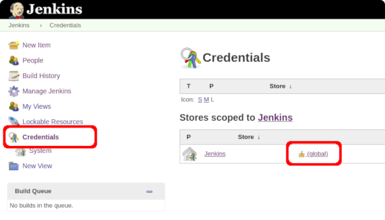
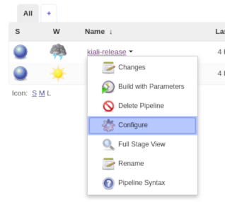
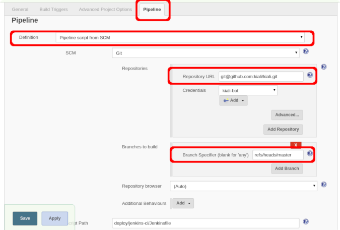

# Jenkins Pipeline

This directory contains the Jenkins Pipeline used to release
the Kiali project, support files used by the Pipeline during
building, and support files to ease the development of the
Pipeline.

## Directory contents

### The Pipeline

The [Jenkinsfile](Jenkinsfile) is the Pipeline. It is written
using [scripted syntax](https://jenkins.io/doc/book/pipeline/syntax/#scripted-pipeline)
which is very similar to the [Groovy language](https://groovy-lang.org/).

The Pipeline is more similar to an orchestrator where build
stages are defined and the actual build implementation
is delegated to Makefiles.

This is the _entrypoint_, so this is the first file you should
check if you want to modify the Pipeline.

### Support files

The [bin/determine-release-type.sh](bin/determine-release-type.sh)
is used to automatically resolve what kind of release needs to be
build, assuming the Pipeline runs weekly. Read the script
to learn more about how it works.

The [bin/jq](https://stedolan.github.io/jq/) v1.6 and
[bin/semver](https://github.com/fsaintjacques/semver-tool) v2.1.0
are tools used to properly set version strings when building releases.

The [Makefile](Makefile) is repeatedly invoked by the Pipeline. It
is analog and compliments the [Makefile.jenkins](https://github.com/kiali/kiali-ui/blob/master/Makefile.jenkins)
of the kiali-ui repository. These are the files where the build
steps are implemented. 


### Development helper files

These files:

* [bin/entrypoint.sh](bin/entrypoint.sh)
* [Dockerfile](Dockerfile)
* [jenkins_ref/*](jenkins_ref)

are provided to create a container that can be used to test
the Pipeline.

### README files

The [README.md](README.md) file is what you are reading. The files
under the `assets` directory are used in the [README.md](README.md).

## Developer setup

Modifying the Pipeline is easy. You just need a text editor :smile:.
See the [Directory contents](#directory-contents) section to have
some understanding about which files you need to change.

The "hard" part is to test the Pipeline. You need a Jenkins instance
with the tools to correctly build both Kiali's back-end and
front-end, and to deploy Kiali. Instead of going through all the
steps to setup such Jenkins instance, a [preconfigured
Docker image](https://hub.docker.com/r/edgarhz/kiali-jenkins) is
available to start as fast as possible. Run it by invoking:

```
docker run \
  -v /var/run/docker.sock:/var/run/docker.sock \
  -p 8080:8080 \
  edgarhz/kiali-jenkins
```

This command assumes that your Docker daemon's socket is in
`/var/run/docker.sock`. The `-v` parameter is needed because
Kiali is released as a container image, which means that Jenkins
needs access to Docker to build and push the container. Using the
provided command, Jenkins will re-use the Docker instance of
your machine.

Once the container is running, use your browser to access Jenkins
at http://localhost:8080. Username and password are both `admin`.

**Note:** The `edgarhz/kiali-jenkins` image is updated now and then.
So, you may find it is old. But it can work for testing.

The image is preconfigured with two jobs:
* **kiali-release:** It is the Pipeline you will be working with.
* **kiali-release-notifier:** It does nothing. It's there because
  the Pipeline invokes this job. In the real setup, it
  does some QE tasks.

### Building the Jenkins image

In case you prefer to build the Jenkins image, all required files
are provided in the [/deploy/jenkins-ci](/deploy/jenkins-ci)
directory of the repository. Inside that directory, simply run:

`docker build -t kiali-jenkins .`

And run the generated image:

```
docker run \
  -v /var/run/docker.sock:/var/run/docker.sock \
  -p 8080:8080 \
  kiali-jenkins
```

Check the [Dockerfile](Dockerfile) to learn how Jenkins is set up.

### Setup Jenkins credentials

The only thing that is not setup in the preconfigured Jenkins
image are _credentials_. I hope you can guess why :smile:.

Before trying anything, you need to properly setup the credentials.
Once you are logged into Jenkins, click _Credentials_ in the menu
at the left, then click _(global)_ in the page that appears:



In the _Global credentials_ page, use the _Add Credentials_ option
at the left to add these five credentials:

* **GitHub SSH keys of the "bot" account**: Used to checkout
  the code to be built, and also to push tags and branches to the
  repositories. For development, you can use an [SSH key
  associated with your GitHub account](https://github.com/settings/keys)
  (it will be safer if you have an account without
  privileges to push to the Kiali repositories.)
  * Kind: SSH Username with private key
  * ID: kiali-bot-gh-ssh
  * Username: whatever you want
  * Private key: A valid SSH private key for GitHub
* **GitHub token of the "bot" account**: Used to make calls to
  the [GitHub REST API](https://developer.github.com/v3/). For
  development, you can use a [GitHub Personal access token](https://github.com/settings/tokens).
  This token and the SSH keys of the previous bullet should
  be associated to the same GitHub account. 
  * Kind: Secret text
  * ID: kiali-bot-gh-token
  * Secret: A valid GitHub token
* **NPM token**: Used to push the front-end release to NPM. For
  development, use any arbitrary string.
  * Kind: Secret text
  * ID: kiali-npm
  * Secret: An arbitrary string.
* **DockerHub credentials:** Used to push the Kiali image to
  DockerHub. For development, use your DockerHub account (it will
  be safer if you use an account without push rights to the
  DockerHub Kiali repositories.)
  * Kind: Username with password
  * ID: kiali-docker
  * Username: A valid DockerHub username
  * Password: A valid DockerHub password
* **Quay credentials:** Used to push the Kiali image and the
  Kiali operator image to Quay.io. For development, use your
  Quay.io account (it will be safer if you use an account
  without push rights to the Quay Kiali repositories.)
  * Kind: Username with password
  * ID: kiali-quay
  * Username: A valid Quay.io username
  * Password: A valid Quay.io password
  
Once you finish setting up credentials, the list should look similar
to the following image and you are ready to start builds:


### Re-configure the Pipeline

This step is optional. The preconfigured job will fetch and use the
[Jenkinsfile](Jenkinsfile) from the `master` branch of the Kiali
back-end repository. So, if you are going to change the
[Jenkinsfile](Jenkinsfile), you need to change this configuration.
Else, skip this section.

On the Jenkins home page, place your mouse pointer over the
_kiali-release_ job. Press the little arrow that appears nexto to
the job name and select _Configure_ in the menu:



In the configuration page, select the _Pipeline_ tab to scroll
down to see the form to change:



You have two options to re-configure:

1. You can change the _Definition_ dropdown to _Pipeline script_ .
   The form will be replaced with an editor. Just paste the edited
   _Jenkinsfile_. Then, save the Pipeline and trigger a build to test
   your changes.
1. Change the _Repository URL_ and the _Branch Specifier_ to
   point to the place where you are pushing your changes. Then,
   save the Pipeline and trigger a build to test your changes.
   
First option is better if you are only changing the [Jenkinsfile](Jenkinsfile).
If you also need to change other support files, you can use either.
